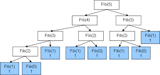

# Fibonacci number

> Recursive approach works back-word means it required last one or two values for current

- It creates many branches

## base Condition

- f(0) = 0
- f(1) = 1

## Recursive case

- if n greater than 1 then return `f(n-1) + f(n-2)`

## Example

- 0 1 1 2 3 5 8 13 21 34 55 89 ....

## Recursive tree



## Code

- `base case`
  - return n if n lesser than or equal to 1

```js
function fibonacci(n) {
  if (n <= 1) return n;
  return fibonacci(n - 1) + fibonacci(n - 2);
}
console.log(fibonacci(5));
console.log(fibonacci(6));
console.log(fibonacci(7));
```

## Time complexity

- Branches
  - n -> 2n -> 4n -> 8n ...
- n \* 2<sup>x</sup>=1
- O(2<sup>n</sup>)
- exponential time complexity
- very bad TC
- Dynamic program will solve this
- Example Rabbit Population
