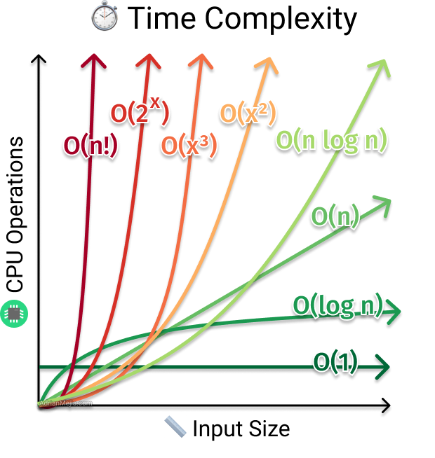

# Complexity

## Time complexity

> It is used to measure efficiency of algorithm in terms of speed as input size grows

> `Time Complexity != time taken(time may be different on different machine)`; this is not time complexity; not right parameter to define efficiency of algorithm

> Speed efficiency -> when input size grows

## Example

| Linear search        | Binary Search                                                |
| -------------------- | ------------------------------------------------------------ |
|                      | only works on sorting array                                  |
| n times runs         | keeps dividing in 2 parts until element found or remains one |
|                      | n/2, n/4, n/8 ... 1                                          |
|                      | n/2 * 1/2 *1/2 ...                                           |
|                      | n/2\*\*x =1                                                  |
|                      | n=2\*\*x                                                     |
|                      | log2n=x                                                      |
| for 100 N, x = 100   | for 100 N, 7 times                                           |
| for 1000 N, x = 1000 | for 1000 N, 10 times                                         |

- **This is Time Complexity**

## Time complexity chart

- 

- Binary search >>>> Linear search in efficiency

## Big O notation

> Measure time complexity in worst case

| Linear Search              | Binary Search                     |
| -------------------------- | --------------------------------- |
| [5,6,11,24]                | [5,8,10,15,20]                    |
| Best Case search(1) x =1   | Best Case search(10) x=1          |
| Worst Case search(100) x=n | Worst case search(100) x=3 log2-5 |

- Notation is just symbol
- Linear search -> O(N)
- Binary search -> O(log N); Better than O(N)

## Common Time Complexity

1. **O(N)** -> Linear search for loop with n iteration i.e. n operation and x=n
2. **O(log N)** -> Binary Search -> n,n/2,n/4 ... 1 -> x = log(n)
3. **O(N\*\*2**) -> Nested For loops

```js
for (let i = 0; i < n; i++) {
  for (let j = 0; j < n; j++) {}
}
```

4. **O(N log N)** -> merge sort

```js
for (let i = 0; i < n; i++) {
  O(log N) algorithm
}
```

5. _O(n \*\* 3)_ -> 3 nested loops of n
6. O(2\*\*n) ->
   1. n=2 4 operation
   2. n=3 9 operation
   3. n=4 16 operation
   4. n=5 25 operation
7. **O(N!)** -> High time complexity

### Constant time complexity O(1)

> in array of n, find eg. second element so time complexity not grows for 10,100,1000

> `O(1) > O(log N) > O(N) > O(N log N) > O(N ** 2) > O(2 ** n) > O(N!)`
> Interviewer ask can you improve it

## Space complexity

```js
find5thElementArray(arr){
    return arr[4];
}
```

- Time complexity O(1)
- Space complexity O(1)

```js
findMax(arr){
    let max = arr[0];
    for(i=0;i<arr.length;i++){
        if(arr[i]>max){
            max=arr[i];
        }
    }
}
```

- Time complexity O(N)
- Space complexity O(1)

```js
double(arr){
    let newArr =[]; // size of arr.length
    for(i=0;i<arr.length;i++){
        newArr[i]=2*arr[i]
    }
    return newArr;
}
```

- Time complexity O(N)
- Space complexity O(N)

- return 2 array of n = Space Complexity = O(n \*\* 2)

## Corner Case

- not nested loops

```js
for (let i = 0; i < n; i++) {}
for (let j = 0; j < n; j++) {}
```

- TC = O(2N) always ignore 2 here
- if O(3N) then it is O(N)

|             | o(n\*\*2)     | O(3N)            |
| ----------- | ------------- | ---------------- |
| N=10        | x=100         | x=30             |
| N=100       | x=10000       | x=300            |
| N=1 million | x = 1Million2 | 3 Million        |
|             |               | so ignore 3 here |

### Same for

```js
for (let i = 0; i < n; i++) {
  for (let j = 0; j < n; j++) {}
}
for (let k = 0; k < n; k++) {}
```

- O(N**2+N) => O(N ** 2)
- always ignore lower value
- 1 million square + 1 million -> adding 1 million to 1 million square doesn't matter
- O(N ** 3 + N + N **2) = O(N \*\* 3)
- O(N ** 2 + 2N) = O(N ** 2)
- O(N ** 2 N log N + 2N + 5) => O(N**2)
- whatever is greater always consider it
